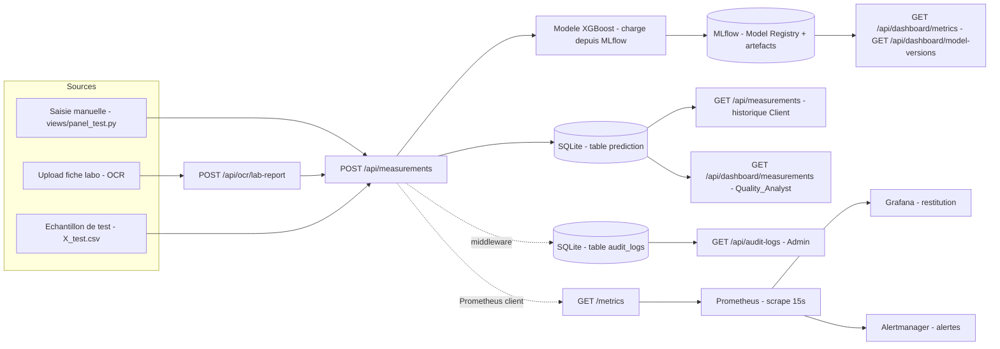

# Compléments de documentation — C15, C16, C17, C19

Ce document rassemble les preuves documentaires qui manquaient pour ces 4 compétences, chacune
dans sa propre section. Il complète (sans les dupliquer) `docs/CI_CD.md`, `docs/MONITORING.md`,
`docs/user_stories.md`, `docs/parcours_utilisateurs.md` et `docs/checklist_C9_C19.md`.

---

## C15 : Concevoir le cadre technique de l'application

Trois éléments manquaient à `docs/CI_CD.md` / à la conception technique existante : les
prestataires éco-responsables, le diagramme de flux de données, et la conclusion de preuve de
concept.

### Choix techniques et éco-responsabilité

| Composant | Choix retenu | Alternative éco-responsable envisagée | Décision |
|---|---|---|---|
| Hébergement / CI | GitHub Actions (`ubuntu-latest`, runners mutualisés Microsoft) | Runner auto-hébergé | GitHub Actions retenu : mutualisation des runners = meilleur taux d'utilisation par machine qu'un runner dédié sous-utilisé pour un projet de cette taille. |
| Registre d'images | GitHub Container Registry (ghcr.io) | Docker Hub | GHCR retenu : même infrastructure que le CI (pas de sauts réseau supplémentaires ni de compte tiers), gratuit et illimité pour les dépôts publics. |
| Stockage du modèle | MLflow (auto-hébergé, conteneur local) | Service SaaS de MLOps managé (ex. Databricks) | MLflow auto-hébergé retenu : évite de dupliquer le stockage des artefacts sur une infra tierce distante, cohérent avec un déploiement local/on-premise à faible volumétrie. |
| Base de données | SQLite (fichier local) | PostgreSQL managé (RDS, etc.) | SQLite retenu : la volumétrie du projet (usage pédagogique/démonstration) ne justifie pas une instance de base de données dédiée en permanence (consommation électrique d'un serveur actif 24/7 pour un usage ponctuel). |

Aucun prestataire cloud à facturation continue n'est utilisé : tous les services tournent soit en
CI éphémère (GitHub Actions, quelques minutes par run), soit en local (`docker-compose`), ce qui
minimise l'empreinte par rapport à une infrastructure cloud active en permanence.

### Diagramme de flux de données

Ce schéma couvre les 3 flux principaux : la collecte (saisie/OCR/échantillon vers la
prédiction), la restitution (historique, dashboard qualité, audit), et le monitorage
(métriques applicatives vers Prometheus/Grafana/Alertmanager).

### Conclusion de la preuve de concept

**Preuve de concept réalisée** : stack complète fonctionnelle en local via `docker-compose up
--build` (5 services : mlflow, api, streamlit, prometheus, grafana/alertmanager), avec un
parcours de bout en bout validé (connexion → prédiction → historique → dashboard qualité →
administration) et une suite de tests automatisés qui passe.

**Avis** : **GO pour la poursuite du projet**, avec deux réserves à lever avant une mise en
production réelle (hors périmètre pédagogique actuel) :
1. Remplacer SQLite par une base de données concurrente-safe (PostgreSQL) si le nombre
   d'utilisateurs simultanés dépasse le cas d'usage actuel (SQLite verrouille l'écriture au
   niveau fichier).
2. Fixer les versions de `requirements.txt` (actuellement non épinglées — voir limite connue
   documentée dans `docs/CI_CD.md`) pour garantir la reproductibilité des builds dans le temps.

Aucun blocage technique ou fonctionnel identifié qui remettrait en cause l'architecture choisie.

---

## C16 : Coordonner la réalisation technique (conduite agile)

### Méthode retenue

**Kanban**, pas Scrum : le projet a été mené par un développeur unique avec des cycles de
livraison irréguliers (pas de sprints à durée fixe), ce qui correspond structurellement à un flux
Kanban (colonnes + limite de travail en cours) plutôt qu'à des sprints Scrum avec engagement de
capacité par itération.

- **Colonnes du tableau** : `À faire` → `En cours` → `En revue (Pull Request)` → `Fait (mergé sur
  main)`.
- **Limite de travail en cours (WIP)** : 1 branche de fonctionnalité active à la fois par
  développeur (cohérent avec l'historique Git : chaque fonctionnalité correspond à une branche
  dédiée mergée via PR avant d'en ouvrir une nouvelle).
- **Outil de pilotage** : tableau Kanban dans l'onglet **GitHub Projects** du dépôt
  (`github.com/ilyes-chabab/waterflow` → onglet Projects), alimenté par les issues GitHub liées
  aux branches de fonctionnalité.

### Backlog rétrospectif (reconstruit depuis l'historique Git)

Le tableau ci-dessous reconstitue le flux Kanban déjà suivi dans les faits, à partir des branches
et pull requests réellement mergées (`git log --merges`) :

| Carte | Branche | PR | Colonne finale |
|---|---|---|---|
| Base de données relationnelle + imputeur | `feature/base-de-donnée` | #1 | Fait |
| API client (auth, RBAC, prédiction) | `BrancheNour` | #2 | Fait |
| Interface analyste qualité (dashboard) | `BrancheNourApi` | #4 | Fait |
| API FastAPI + gestion de comptes + logs d'audit | `BrancheNourApi` | #5 | Fait |
| Chaîne CI/CD (tests, packaging modèle) | `feature/ci-cd` | (merge direct) | Fait |
| Réorganisation de l'arborescence + tests fonctionnels | `finalisation` | (en cours) | En revue |

### Rituels

| Rituel | Fréquence | Objectif | Outil |
|---|---|---|---|
| Point d'avancement | Hebdomadaire (à minima) | Communiquer l'avancement des cartes, lever les blocages | Tableau Kanban GitHub Projects + message de synthèse |
| Revue de code (PR) | À chaque fin de carte | Valider une carte avant de la faire glisser en `Fait` | Pull Request GitHub |
| Rétrospective légère | À chaque merge sur `main` | Identifier un point d'amélioration (ex. bug trouvé, dette technique) | `tests/bugTrouvé_README.md`, `docs/incidents/` |

Les objectifs et modalités de ces rituels sont documentés ici même (ce fichier), point de
référence unique partagé avec toutes les parties prenantes du projet.

### Accessibilité du pilotage

Le tableau Kanban (GitHub Projects) et ce document sont tous deux en texte structuré
(HTML sémantique généré par GitHub / Markdown), cohérent avec l'approche déjà retenue pour le
reste de la documentation (voir `docs/ACCESSIBILITE_DOCUMENTATION.md`) : navigable au clavier et
par lecteur d'écran, sans information portée uniquement par une couleur ou une image.

---

## C17 : Développer les composants techniques et les interfaces (éco-conception)

Recommandations [EcoIndex](https://www.ecoindex.fr/) / Green IT appliquées ou déjà respectées
dans le code de `ui.py` et `views/*.py` :

| Bonne pratique | État dans le projet |
|---|---|
| Limiter le nombre de requêtes réseau par page | Chaque page (`views/*.py`) ne fait qu'un seul appel GET principal (pas de polling, pas de rafraîchissement automatique) ; le rafraîchissement est déclenché explicitement par un bouton (ex. "Actualiser les prélèvements"). |
| Pagination / limitation des volumes de données transférés | **Limite identifiée** : `GET /api/dashboard/measurements` et `GET /api/measurements` renvoient l'intégralité de l'historique sans pagination. À corriger avant un usage à volumétrie réelle (ajouter `limit`/`offset`). |
| Pas de rafraîchissement automatique inutile (polling) | Respecté : aucune page n'utilise `st.rerun()` en boucle ou de minuterie ; tout rafraîchissement est déclenché par une action utilisateur explicite. |
| Compression des assets | Non applicable : l'UI Streamlit ne sert pas d'assets statiques lourds (pas d'images/vidéos, une seule image de test utilisée en fixture de test). |
| Choix d'un format de stockage sobre | SQLite (fichier local, pas de serveur actif en permanence) plutôt qu'un SGBD client-serveur pour une volumétrie de ce niveau (voir C15). |

**Action de suivi** (hors périmètre de ce complément documentaire, à traiter comme évolution du
code) : ajouter la pagination sur `GET /api/measurements` et `GET /api/dashboard/measurements`
avant toute mise en production avec un volume de prélèvements important.

---

## C19 : Créer un processus de livraison continue de l'application

Cette compétence est désormais couverte par le code (job `delivery` dans
`.github/workflows/ci.yml`, voir `docs/CI_CD.md`) : après validation de la CI (`needs: ci`) et
uniquement sur push vers `main`, la chaîne construit et **publie** (`docker/build-push-action`,
`push: true`) les images `waterflow2-api` et `waterflow2-ui` sur GitHub Container Registry
(`ghcr.io/ilyes-chabab/waterflow-api` et `-ui`), taguées à la fois par le SHA du commit et
`latest`. Aucun secret supplémentaire n'est requis : l'authentification au registre utilise le
`GITHUB_TOKEN` fourni automatiquement par GitHub Actions (`permissions: packages: write`).

Ce point n'appelait donc pas de complément purement documentaire distinct : voir la mise à jour
correspondante dans `docs/CI_CD.md`.
