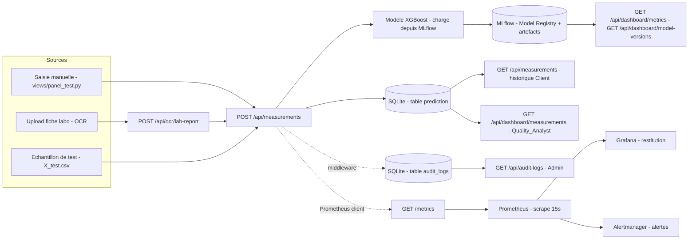

### Diagramme de flux de données


```mermaid
flowchart LR
    subgraph Sources
        A[Saisie manuelle - views/panel_test.py]
        B[Upload fiche labo - OCR]
        C[Echantillon de test - X_test.csv]
    end

    A --> D[POST /api/measurements]
    B --> E[POST /api/ocr/lab-report] --> D
    C --> D

    D --> F[(SQLite - table prediction)]
    D --> G[Modele XGBoost - charge depuis MLflow]
    G --> H[(MLflow - Model Registry + artefacts)]

    F --> I[GET /api/measurements - historique Client]
    F --> J[GET /api/dashboard/measurements - Quality_Analyst]
    H --> K[GET /api/dashboard/metrics - GET /api/dashboard/model-versions]

    D -.->|middleware| L[(SQLite - table audit_logs)]
    L --> M[GET /api/audit-logs - Admin]

    D -.->|Prometheus client| N[GET /metrics]
    N --> O[Prometheus - scrape 15s]
    O --> P[Grafana - restitution]
    O --> Q[Alertmanager - alertes]
```

dependances : 
```
mlflow
bcrypt
streamlit
requests
flask
numpy
xgboost
scikit-learn
imbalanced-learn
pytest
pytest-cov
httpx
slowapi
prometheus-client
```