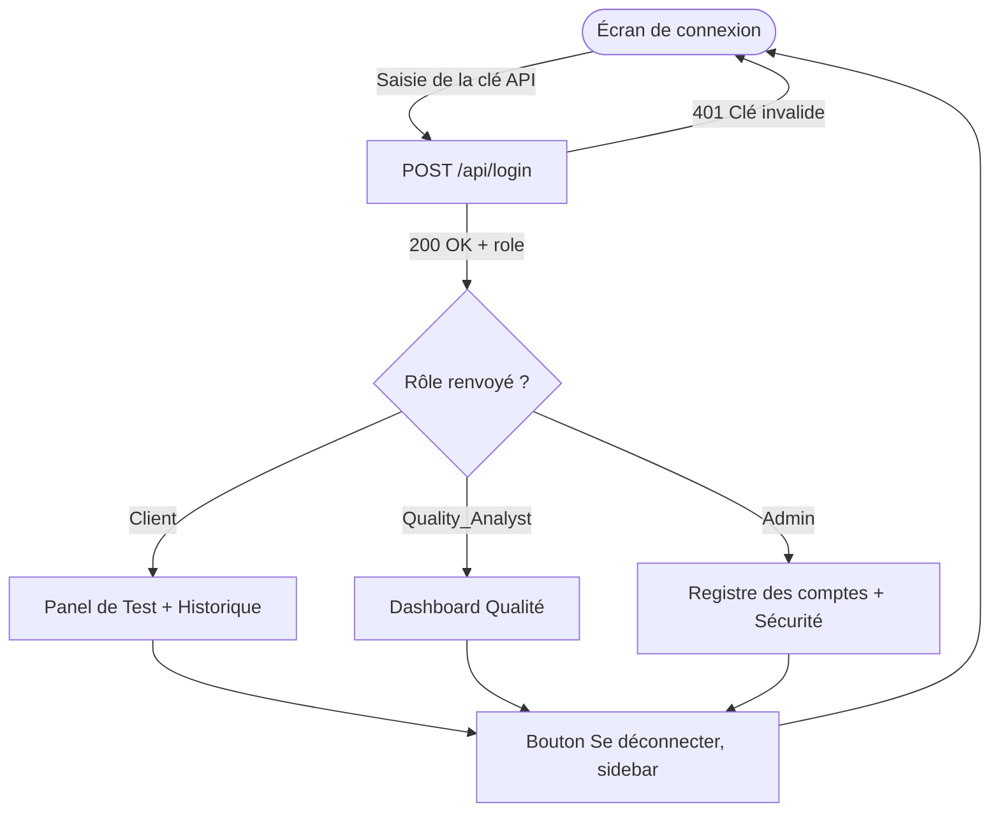
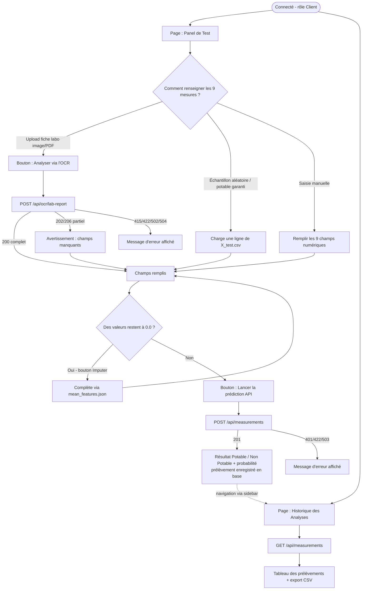
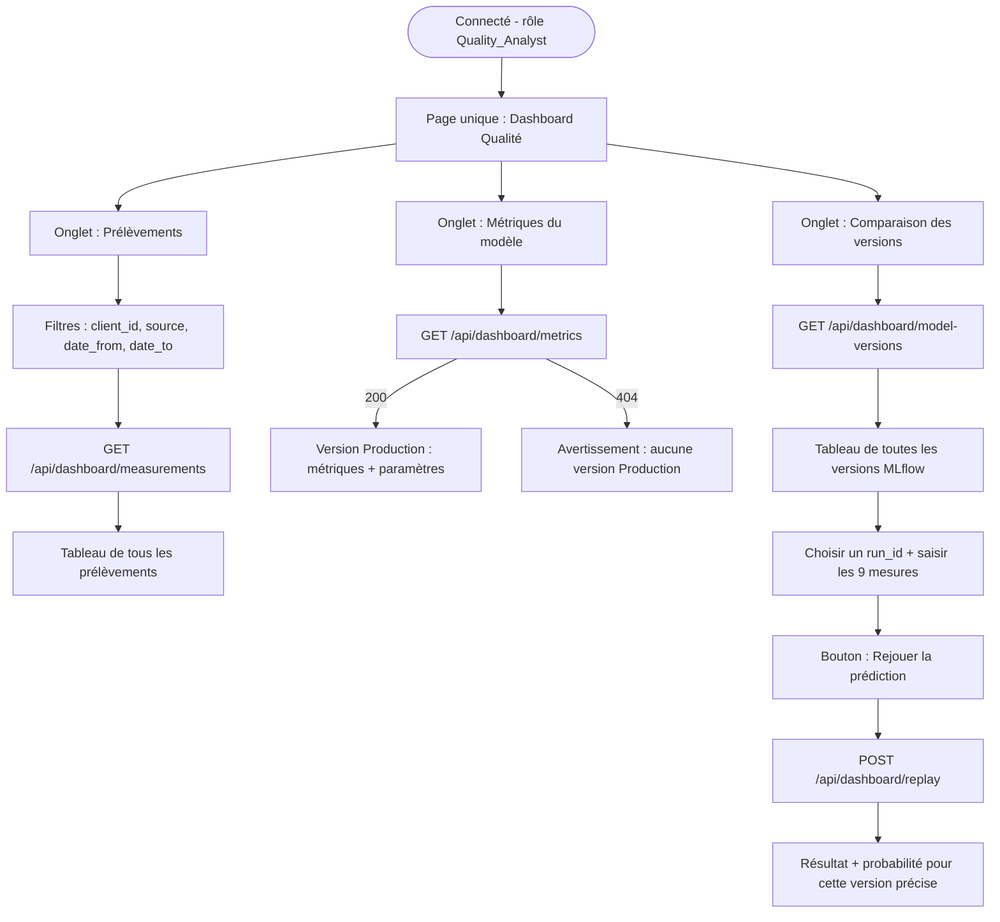
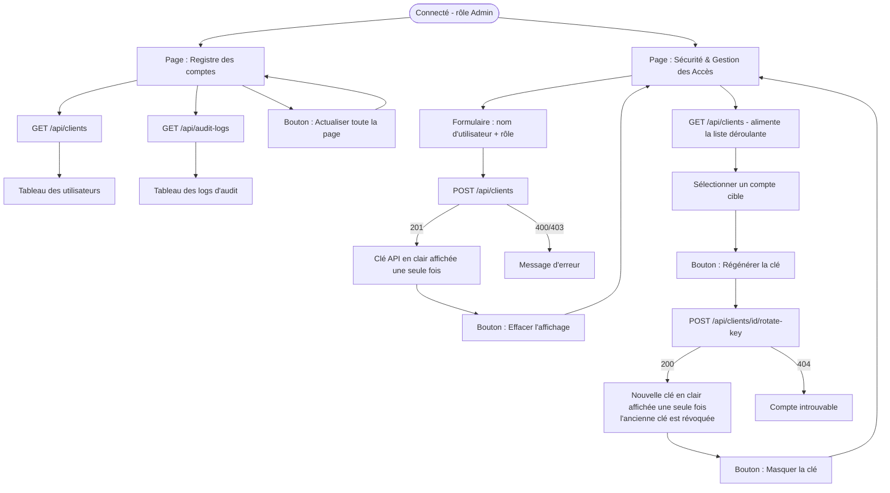

# Parcours utilisateurs - Waterflow 2

Schémas fonctionnels dérivés de la logique de routage dans `ui.py` (`st.navigation` selon
`st.session_state.role`) et des actions déclenchées dans `views/*.py` / `dashboard_qualite.py`.

Pour visualiser : coller un bloc dans [mermaid.live](https://mermaid.live), ou utiliser
l'extension "Markdown Preview Mermaid Support" dans VS Code pour prévisualiser ce fichier
directement.

## 0. Authentification & aiguillage par rôle (commun à tous)

## 1. Parcours Client (`views/panel_test.py` + `views/historique.py`)

## 2. Parcours Quality_Analyst (`dashboard_qualite.py`, 3 onglets)

## 3. Parcours Admin (`views/accueil_admin.py` + `views/securite_admin.py`)

